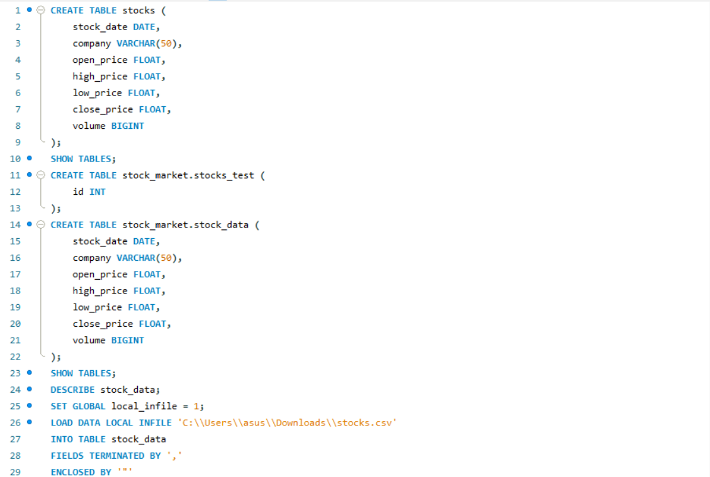

# stock-market-analysis-project
Stock Market Analysis using MySQL and Tableau

## Overview
This project focuses on analyzing stock market data using MySQL and Tableau. The goal is to extract meaningful insights and visualize stock trends through an interactive dashboard.

## Tools Used
* MySQL (Data Analysis)
* Tableau (Data Visualization)
* CSV Dataset

## Dataset
The dataset contains historical stock data including:
* Date
* Open Price
* High Price
* Low Price
* Close Price
* Volume

## 🔍 SQL Analysis
Performed various SQL queries such as:
* Highest and Lowest Price
* Average Closing Price
* Daily Return Calculation
* Percentage Return
* Trading Volume Analysis

## Tableau Dashboard
Created an interactive dashboard including:
* Stock Price Trend
* Moving Average
* Volume Analysis
* Volatility
* Correlation

## Key Insights
* The stock showed an overall upward trend.
* Moving average indicates steady growth.
* Volume spikes suggest increased investor activity.
* Stock volatility remained moderate.

## SQL Analysis Output

## Conclusion
This project demonstrates how SQL and Tableau can be used together to analyze and visualize stock market data effectively.

## Project Files
* SQL Queries
* Tableau Dashboard
* Dataset
* Project Report
